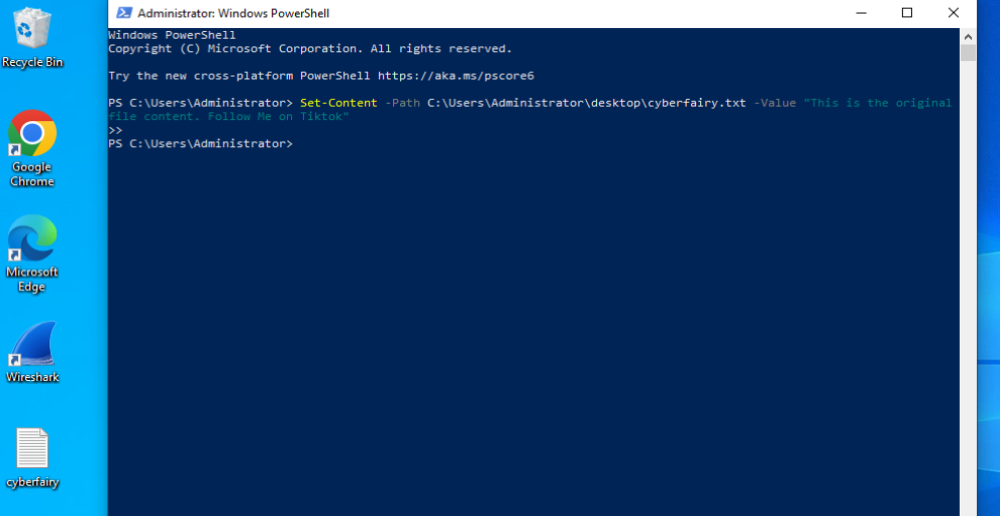
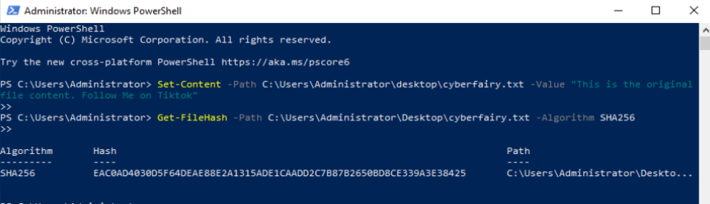
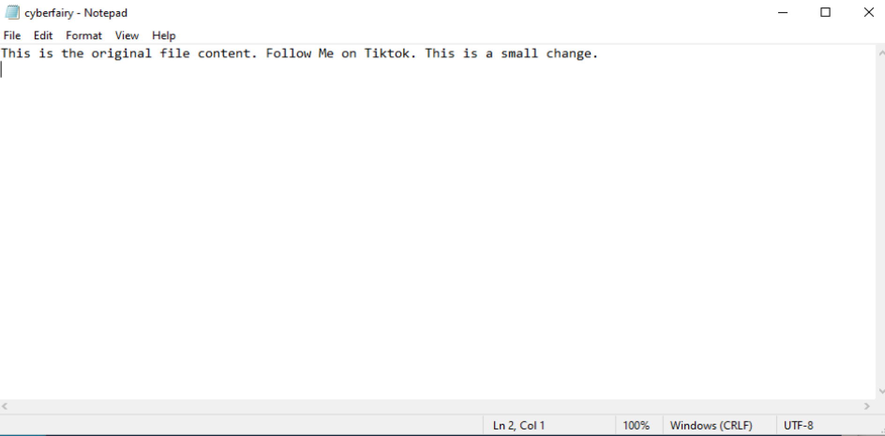
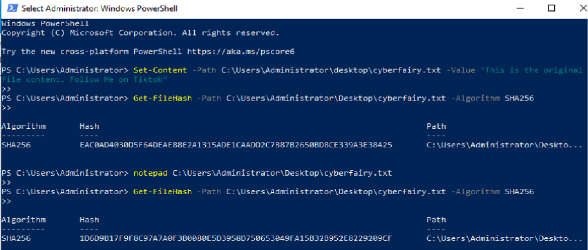
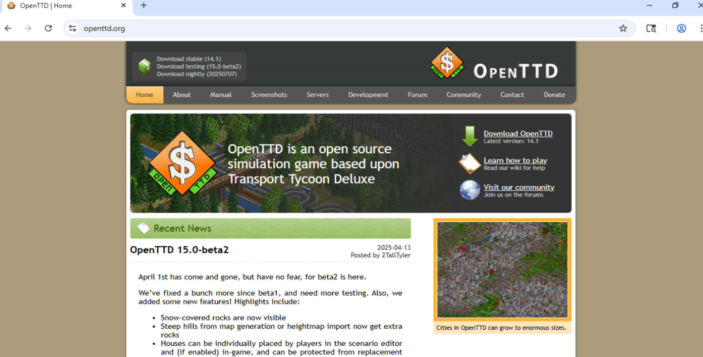
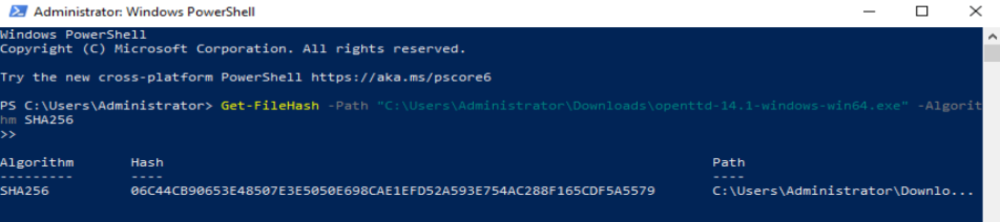
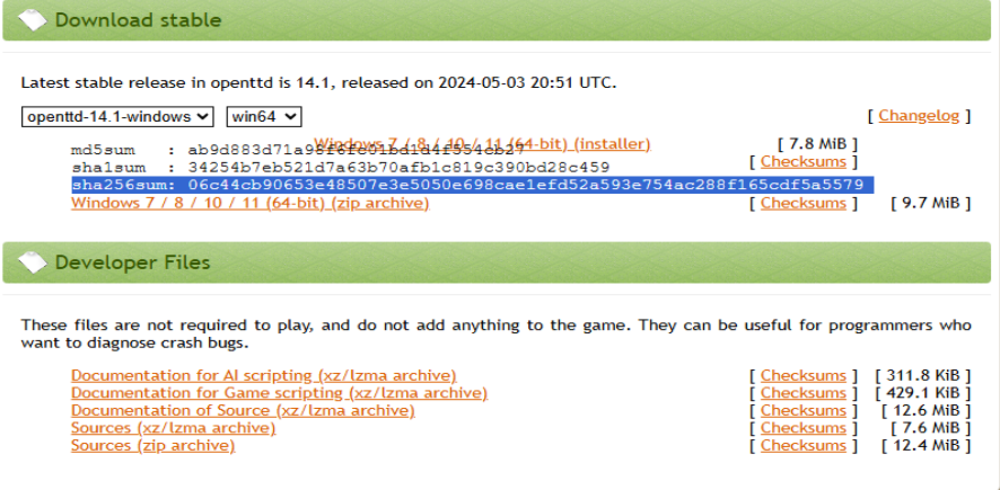
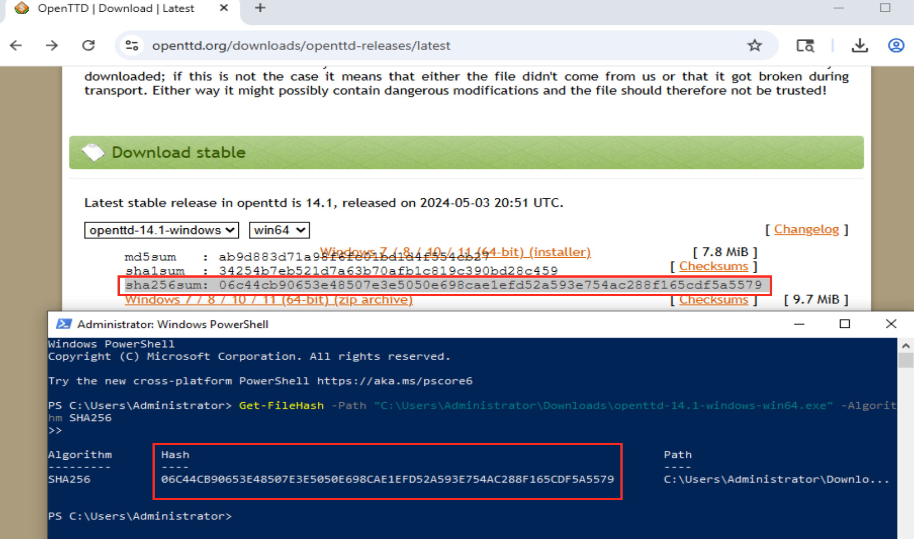

# SHA-256 File Integrity Lab (Windows 10)

## 🔍 Why I Did This Lab

I created this lab to better understand how SHA-256 hashes work and why they matter in cybersecurity. I wanted to see for myself how even a tiny change to a file completely alters its fingerprint, and how SOC analysts use that fingerprint to detect tampering and verify the trustworthiness of files. This hands-on practice helped me connect the concept of file integrity to real-world security work.

---

## 🧪 What I Did

I ran this lab on my Windows 10 VM in two parts:

### Part 1: Created and Modified My Own File
- I created a `.txt` file with a single line of text
- I generated a SHA-256 hash of the file using PowerShell
- I edited the file by adding one new line
- I generated a new hash and saw how different it was

### Part 2: Verified a Real Game Installer
- I downloaded the official OpenTTD game installer
- I generated its SHA-256 hash locally
- I compared it to the official hash published on the website
- The hashes matched, confirming the file was authentic

---

## 💻 PowerShell Commands Used in This Lab

### 🔹 Step 1: Create a Text File with Custom Content
```powershell
Set-Content -Path "$env:USERPROFILE\Desktop\example.txt" -Value "Enter your original text here."
```

### 🔹 Step 2: Get the SHA-256 Hash
```powershell
Get-FileHash -Path "$env:USERPROFILE\Desktop\example.txt" -Algorithm SHA256
```

### 🔹 Step 3: Edit the File (Manual Step)
Open the file in Notepad:
```powershell
notepad "$env:USERPROFILE\Desktop\example.txt"
```
Then add a new line such as:
```
This is a small change.
```

### 🔹 Step 4: Re-run the Hash Check
```powershell
Get-FileHash -Path "$env:USERPROFILE\Desktop\example.txt" -Algorithm SHA256
```

---

## 🔐 What SHA-256 Means (Plain English)

SHA-256 is a hashing algorithm that gives a file a unique digital fingerprint. That fingerprint looks random but is always the same for the same file. If even one letter changes, the fingerprint completely changes. It's one of the most trusted algorithms today because it's strong, secure, and collision-resistant.

In this lab, I used SHA-256 to:
- Detect small changes to a file I made myself
- Verify the integrity of a real installer before trusting it

---

## 📸 Screenshots and Captions (Visible)

### Part 1: Custom File

**Created `cyberfairy.txt` on Desktop using PowerShell with a single line of text**  


**Generated the original SHA-256 hash of `cyberfairy.txt` using PowerShell**  


**Opened `cyberfairy.txt` in Notepad and added a second sentence**  


**Recalculated the SHA-256 hash after editing—hash is now completely different**  


---

### Part 2: OpenTTD Installer

**Navigated to the official OpenTTD site and downloaded version 14.1 for Windows**  


**Generated SHA-256 hash of the OpenTTD installer using PowerShell**  


**Viewed the official SHA-256 hash from the Checksums page**  


**Pasted both hashes in Notepad and confirmed they match**  


---

## 🧠 Reflection Questions

**What does SHA-256 do?**  
It creates a unique fingerprint for a file. That fingerprint changes completely if the file changes, even by one character.

**Why are file hashes important in cybersecurity?**  
They help us detect tampering, verify the legitimacy of files, and confirm that files haven't been altered during download or transfer.

**Why is SHA-256 better than older algorithms like MD5 or SHA-1?**  
Because it's much harder to fake. Older algorithms can be tricked into producing the same fingerprint for different files. SHA-256 is still considered secure and collision-resistant.

**Is the hash random?**  
It looks random, but it isn’t. It's a calculated result based on the content of the file. Same file, same hash every time.

**What is a checksum?**  
A checksum is just another name for a file hash. It’s like a receipt that proves what’s inside the file hasn’t changed.

---

## 🧩 What I Learned

- SHA-256 is a one-way function that creates a consistent, unique output
- Even a small change to a file results in a completely different hash
- Hashes are powerful for integrity checking but can’t detect behavior or intent
- SOC analysts often use hashes alongside other tools to detect threats and verify file trust

---


